<h3>Compte rendu</h3>
- Créer un projet Spring Boot
- Créer les entités JPA : Customer, BankAccount, Saving Account, CurrentAccount, AccountOperation
  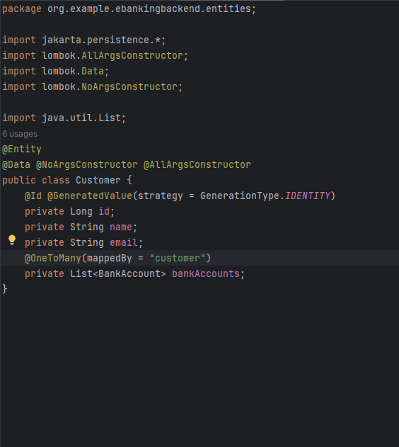
  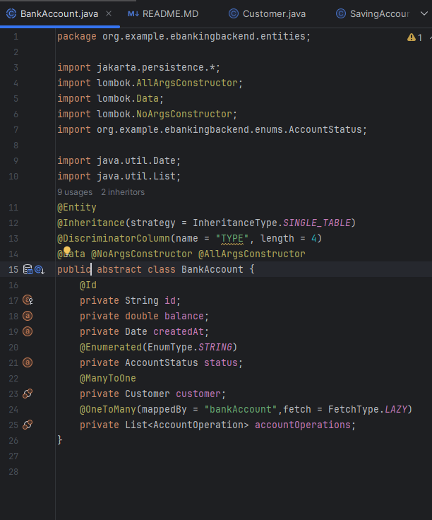
  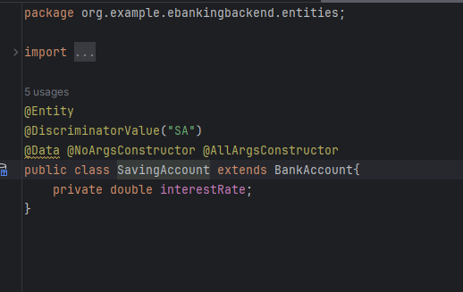
  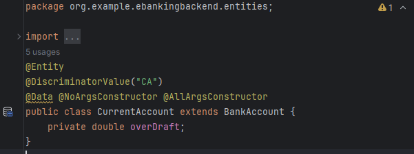
  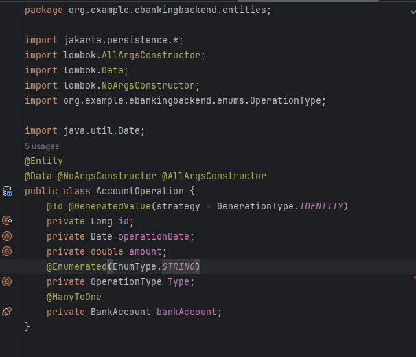
- Créer les interfaces JPA Repository basées sur Spring Data
  
  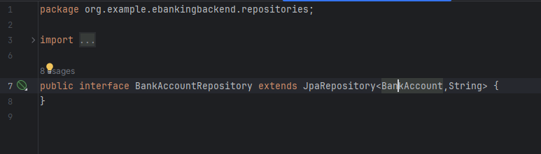
  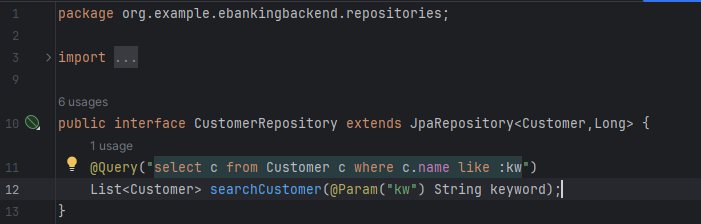

- Couche service
  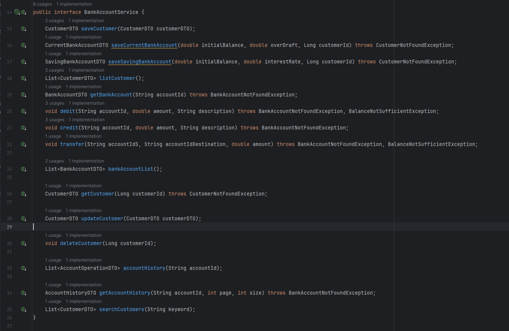
  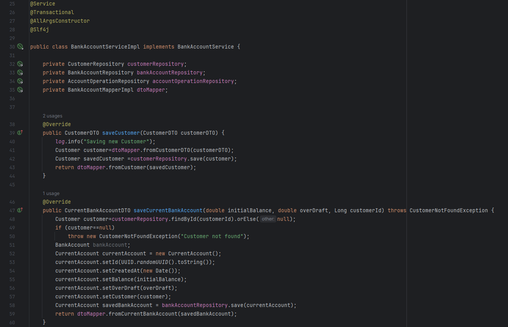
  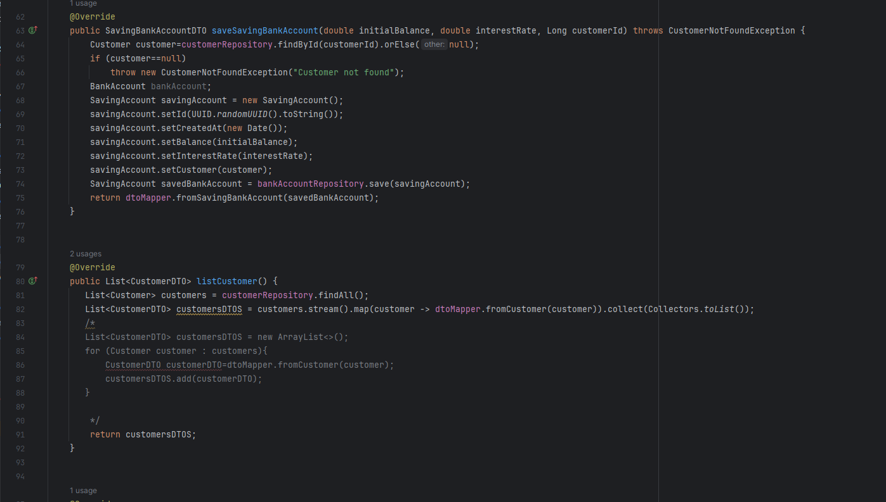
  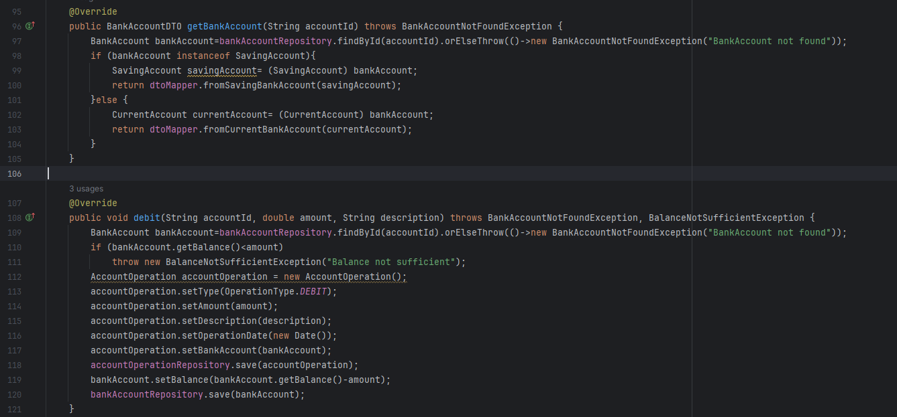
  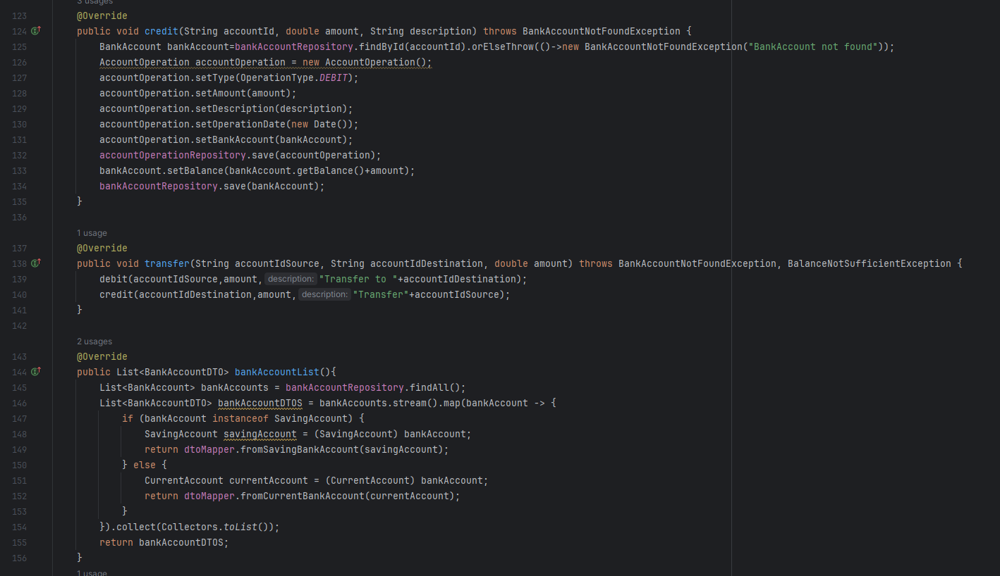
  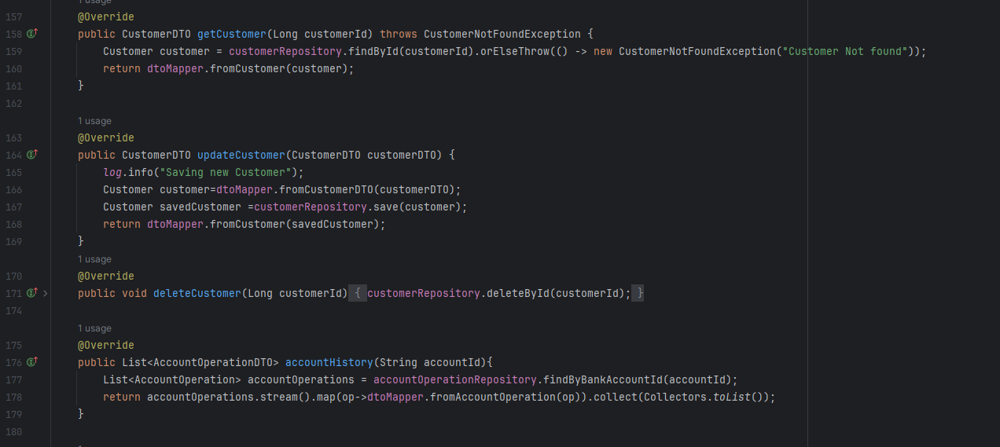
  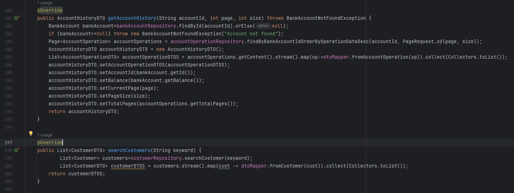
  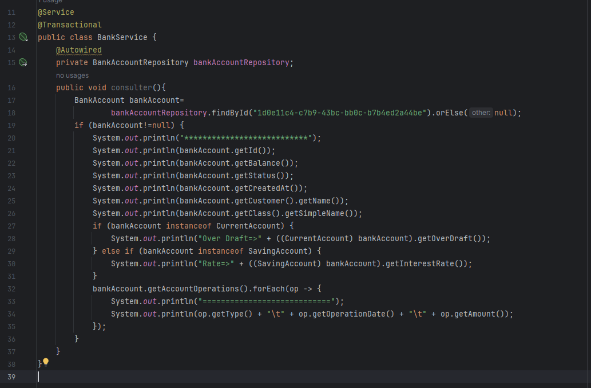
- DTOs
  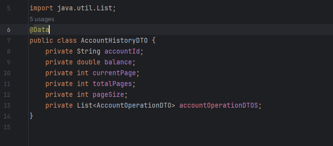
  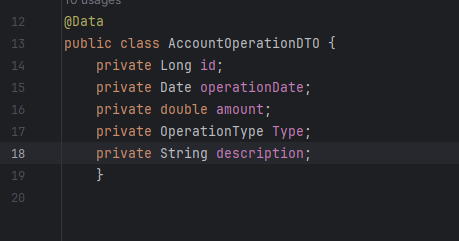
  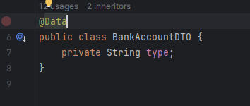
  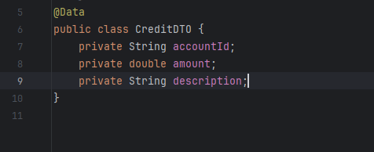
  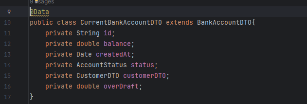
  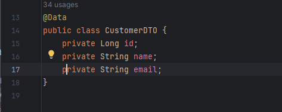
  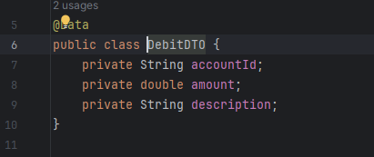
  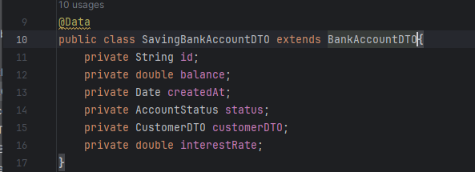
  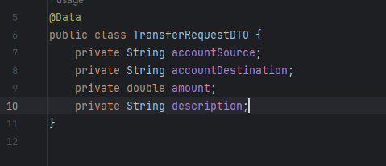
- Mappers
  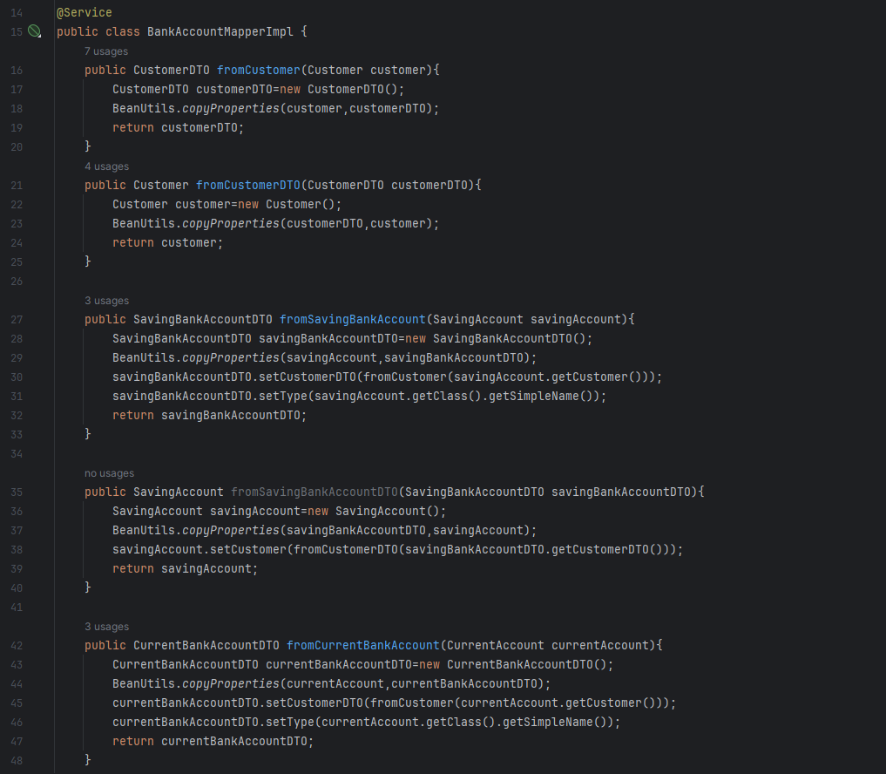
  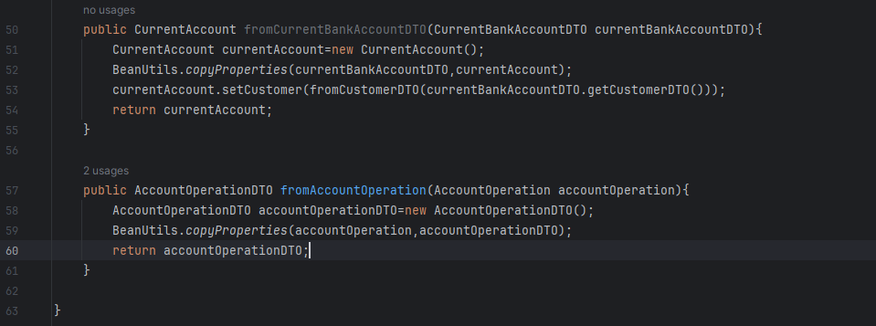
- RestController
  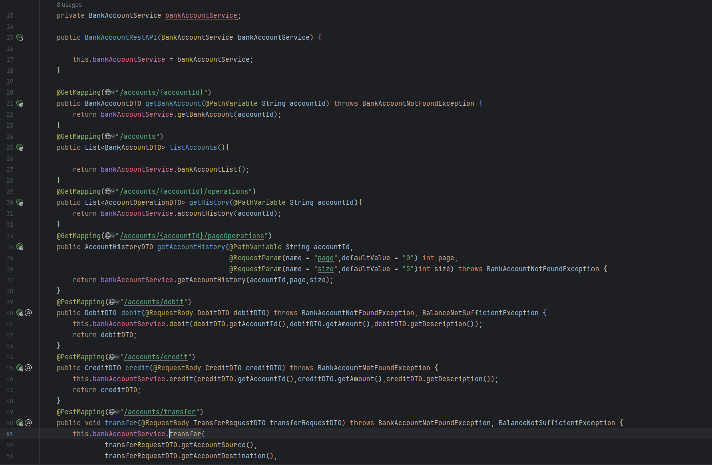
  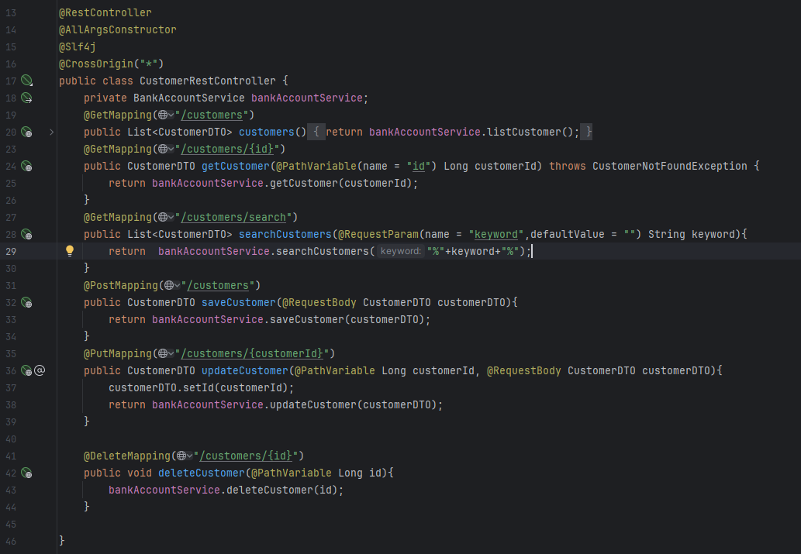

